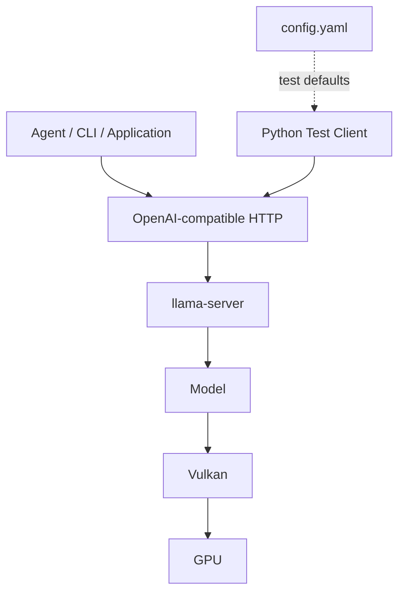

# Local Qwen Model API
Local Qwen OpenAI-Compatible Model Service

## 簡介

本專案使用 `llama.cpp` 在本機載入相容的 GGUF 模型，並提供 OpenAI-compatible Chat API。預設配置使用 Qwen，但其他 Agent、CLI、Web 或應用程式只需透過 HTTP 呼叫模型，不需要知道 GGUF 檔名或直接操作推論引擎。

本專案的責任範圍是 Model Service。Session、Memory、RAG、Tool Calling、權限管理及 Agent workflow 應由呼叫端負責。

### 版本簡述

Version 1.0.0

```text
- Windows 本機 OpenAI-compatible Model API
- llama.cpp-compatible GGUF model
- OpenAI-compatible chat completions
- CPU / GPU inference backend
- Non-streaming / streaming
- Python smoke test / terminal chat test
```

## 目錄

- [簡介](#簡介)
- [專案特色](#專案特色)
- [完整架構](#完整架構)
- [檔案結構](#檔案結構)
- [測試環境](#測試環境)
- [快速開始](#快速開始)
  - [1. 取得專案與 Python 環境](#1-取得專案與-python-環境)
  - [2. 安裝 llama.cpp Vulkan Runtime](#2-安裝-llamacpp-vulkan-runtime)
  - [3. 下載模型](#3-下載模型)
  - [4. 啟動 API Server](#4-啟動-api-server)
  - [5. 驗證服務](#5-驗證服務)
- [詳細使用說明](#詳細使用說明)
- [Local API Server](#local-api-server)
  - [API Config](#api-config)
  - [Health Check](#health-check)
  - [Chat Completions](#chat-completions)
  - [Streaming](#streaming)
  - [Agent Integration](#agent-integration)
- [技術整合說明](#技術整合說明)
- [常見問題](#常見問題)
- [安全與功能範圍](#安全與功能範圍)
- [特別感謝](#特別感謝)
- [關於作者](#關於作者)

## 完整架構



## 檔案結構

```text
.
├─ README.md
├─ client.py               # HTTPX 模型 Client
├─ main.py                 # 終端多輪問答測試
├─ config.yaml             # 內建 Client 預設設定
├─ requirements.txt
└─ scripts/
    ├─ start.bat           # 啟動 llama-server
    └─ test.py             # API test
```

`models/`, `runtime/llama.cpp/` 由 `.gitignore` 排除

User 需要自行下載 Runtime 與模型

## 測試環境

| 項目 | 設定 |
| --- | --- |
| OS | Windows x86_64 |
| GPU | AMD Radeon RX 6700 XT 12 GB |
| Backend | Vulkan |
| 推論引擎 | llama.cpp |
| Model | Qwen3-VL-8B-Instruct-abliterated-v2.0 |
| Quantization | Q4_K_M |
| Context / slots | 16384 / 1 |
| Python | 3.11 |

## 快速開始

### 1. 建立環境

```powershell
git clone https://github.com/hsiuyulin09/Local-LLM-Model.git
cd Local-LLM-Model

conda create -n local-model python=3.11 -y
conda activate local-model
python -m pip install -r requirements.txt
```

### 2. 安裝 llama.cpp Vulkan Runtime

本專案使用 Vulkan 測試環境。從 [llama.cpp Releases](https://github.com/ggml-org/llama.cpp/releases) 下載 Windows x64 Vulkan build，其他硬體請選擇對應 backend 的 build。將內容解壓縮至：

```text
runtime/llama.cpp/
```

檔案至少包含 `llama-server.exe` 與 `ggml-vulkan.dll`

```powershell
.\runtime\llama.cpp\llama-server.exe --version
```

本專案驗證的版本與 Runtime ZIP SHA-256

```text
version: 0.1.1-dev (build 10472, commit 60eeeb608)
SHA256: 2104E62C7E5237F2190240CDC987D8C3946A77051F696771D03B8D762A9D2FAE
```

### 3. 下載模型

預設測試模型來源：[Qwen3-VL-8B-Instruct-abliterated-v2.0-GGUF](https://huggingface.co/mradermacher/Qwen3-VL-8B-Instruct-abliterated-v2.0-GGUF)

```powershell
New-Item -ItemType Directory -Path ".\models\qwen3-vl-8b" -Force

$modelFile = ".\models\qwen3-vl-8b\Qwen3-VL-8B-Instruct-abliterated-v2.0.Q4_K_M.gguf"
$modelUrl = "https://huggingface.co/mradermacher/Qwen3-VL-8B-Instruct-abliterated-v2.0-GGUF/resolve/main/Qwen3-VL-8B-Instruct-abliterated-v2.0.Q4_K_M.gguf?download=true"

curl.exe --location --fail --retry 3 --continue-at - --progress-bar --output $modelFile $modelUrl
```

驗證模型

```powershell
Get-Item -LiteralPath $modelFile | Select-Object Length
Get-FileHash -LiteralPath $modelFile -Algorithm SHA256
```

SHA-256

```text
Size:   5027785824 bytes
SHA256: E462AF5C4D867483DBC58A9354D1CEE4A701EC02B49A557F4129724B23416B3D
```

### 4. 啟動 API Server

```powershell
.\scripts\start.bat
```

出現以下訊息代表服務已就緒：

```text
model loaded
listening on http://127.0.0.1:8080
```

使用 LLM 服務時 Server 終端必須保持運行。使用 `Ctrl+C` 停止服務。

### 5. 驗證服務

另開一個終端：

```powershell
conda activate local-model
python .\scripts\test.py
```

預期結果：

```text
[OK] provider: qwen3-vl-8b
[OK] POST v1/chat/completions
assistant: API test successful
```

## 詳細使用說明

### Client Config

`config.yaml` 控制內建 Python Client：

```yaml
provider: local_qwen

providers:
  local_qwen:
    base_url: "http://127.0.0.1:8080/v1/"
    model: "qwen3-vl-8b"
    timeout: 600

generation:
  temperature: 1
  max_tokens: 4096
  top_p: 0.9
  presence_penalty: 1.0
```

`generation` 是 request 預設值，不是 Server 的硬性限制。外部 Agent 應在自己的 provider config 管理這些設定。

### Terminal Chat Test

API Server 運行時，可使用終端多輪問答：

```powershell
python .\main.py
```

輸入 `q` 或 `quit` 結束。

### Server Runtime Parameters

`scripts/start.bat` 目前使用：

| 參數 | 值 | 用途 |
| --- | --- | --- |
| `--alias` | `qwen3-vl-8b` | API model ID |
| `--host` | `127.0.0.1` | 僅允許本機連線 |
| `--port` | `8080` | HTTP port |
| `-c` | `16384` | context 上限 |
| `-np` | `1` | 同時執行一個 inference request |
| `-ngl` | `99` | 將可用模型層 offload 至 GPU |
| `--jinja` | enabled | 使用模型 chat template |

## Local API Server

### API Config

```text
Base URL: http://127.0.0.1:8080/v1/
Model:    qwen3-vl-8b
Timeout:  建議 600 秒
```

主要 endpoint：

| Method | Endpoint | 用途 |
| --- | --- | --- |
| `GET` | `/v1/models` | 取得目前提供的 model ID |
| `POST` | `/v1/chat/completions` | 文字 Chat Completion |
| `GET` | `/props` | 取得 llama-server Runtime 設定 |

### Health Check

```powershell
Invoke-RestMethod "http://127.0.0.1:8080/v1/models" |
    ConvertTo-Json -Depth 5
```

應能在 `data` 陣列中找到：

```json
{
  "id": "qwen3-vl-8b",
  "object": "model"
}
```

檢查實際 context 與 slot：

```powershell
$props = Invoke-RestMethod "http://127.0.0.1:8080/props"
$props.model_alias
$props.default_generation_settings.n_ctx
$props.total_slots
```

預期依序為：

```text
qwen3-vl-8b
16384
1
```

### Chat Completions

Request line 與 headers：

```http
POST /v1/chat/completions HTTP/1.1
Host: 127.0.0.1:8080
Content-Type: application/json
```

Request body：

```json
{
  "model": "qwen3-vl-8b",
  "messages": [
    {
      "role": "system",
      "content": "You are a helpful assistant."
    },
    {
      "role": "user",
      "content": "請用繁體中文回答。"
    }
  ],
  "temperature": 0.8,
  "max_tokens": 2048,
  "top_p": 0.9,
  "stream": false
}
```

PowerShell 測試：

```powershell
$body = @{
    model = "qwen3-vl-8b"
    messages = @(
        @{ role = "user"; content = "請用一句話介紹你自己。" }
    )
    max_tokens = 256
    stream = $false
} | ConvertTo-Json -Depth 5

Invoke-RestMethod `
    -Uri "http://127.0.0.1:8080/v1/chat/completions" `
    -Method Post `
    -ContentType "application/json" `
    -Body $body
```

主要 response 結構：

```json
{
  "choices": [
    {
      "message": {
        "role": "assistant",
        "content": "模型回答"
      }
    }
  ],
  "usage": {
    "prompt_tokens": 0,
    "completion_tokens": 0,
    "total_tokens": 0
  }
}
```

### Streaming

Server 已支援 streaming。呼叫端將 `stream` 設為 `true`，並逐段處理 response：

```python
from openai import OpenAI

client = OpenAI(
    base_url="http://127.0.0.1:8080/v1/",
    api_key="local",
    timeout=600,
)

stream = client.chat.completions.create(
    model="qwen3-vl-8b",
    messages=[{"role": "user", "content": "你好"}],
    stream=True,
)

parts = []
for chunk in stream:
    content = chunk.choices[0].delta.content
    if content:
        parts.append(content)
        print(content, end="", flush=True)

answer = "".join(parts)
```

OpenAI Python SDK 不屬於本專案依賴。此範例應在 Agent 專案安裝 `openai` 後使用。

### Agent Integration

外部 Agent 可加入以下 provider：

```yaml
provider: local_qwen

providers:
  local_qwen:
    base_url: "http://127.0.0.1:8080/v1/"
    api_key: "local"
    model: "qwen3-vl-8b"
    timeout: 600
```

目前 Server 未啟用 authentication。`api_key: local` 只是滿足部分 OpenAI SDK 的非空欄位要求，不是安全憑證。

llama-server 不保存 Session。每次 request 都必須傳入該次推論需要的對話：

```python
messages = [
    {"role": "system", "content": "..."},
    {"role": "user", "content": "第一個問題"},
    {"role": "assistant", "content": "第一個回答"},
    {"role": "user", "content": "後續問題"},
]
```

Agent 端應負責：

- Session 與 conversation history
- Context token 預算、裁切與摘要
- Timeout、取消、重試與排隊狀態
- Streaming chunk 組合
- Memory、RAG、Tool Calling 與權限控制
- Server 離線時清楚報錯，不應未經設定自行切換雲端模型

## 技術整合說明

### llama-server

`llama-server` 負責載入 GGUF、管理 KV cache、執行 token generation，並提供 OpenAI-compatible HTTP API。Python 只用於本專案的測試 Client，不是啟動 Model Server 的必要條件。

### Hardware Backend

llama.cpp 不限定單一 GPU。應依作業系統、硬體與驅動程式選擇對應 build：

| Backend | 主要硬體 |
| --- | --- |
| CPU | x86 / ARM CPU |
| CUDA | NVIDIA GPU |
| HIP / ROCm | AMD GPU |
| Vulkan | 支援 Vulkan 的 GPU |
| SYCL | Intel GPU |
| Metal | Apple Silicon |

完整清單與建置方式請參考 [llama.cpp 官方文件](https://github.com/ggml-org/llama.cpp/blob/master/docs/build.md)。不同硬體需要重新評估 `-c`、`-np` 與 `-ngl`。

### Model Compatibility

模型不限定為 Qwen，但必須是目前 llama.cpp build 支援的 GGUF 模型。Chat API 也需要可用的 chat template；Vision 模型則需要相符的 multimodal projector。

目前 `scripts/start.bat` 與 `config.yaml` 預設使用 Qwen3-VL-8B。替換模型時需要同步修改：

- `start.bat` 的模型路徑
- `--alias` 的 model ID
- `config.yaml` 的 `model`
- 外部 Agent 使用的 model ID

Agent 應使用 alias，不應依賴實際 GGUF filename。保留相同 alias 時，呼叫端不需要因為更換模型檔或量化版本而修改。

### Context 與 Concurrency

`-c 16384` 包含 prompt 與模型輸出。Agent 必須保留輸出空間，並在 request 前裁切或摘要過長的歷史訊息。

`-np 1` 代表同時只有一個 active inference slot。額外 request 由 llama-server 排隊，但 Client 仍應處理 timeout 與取消。

## 常見問題

| 狀況 | 處理方式 |
| --- | --- |
| 無法連線 `127.0.0.1:8080` | 執行 `scripts/start.bat`，並保持 Server 終端運行 |
| `cannot find model` | 確認 request 的 `model` 是 `qwen3-vl-8b` |
| HTTP 400 context size error | 減少歷史訊息或輸出上限，使兩者合計低於 16384 tokens |
| GPU 記憶體不足 | 降低 `-c`，必要時降低 `-ngl` |
| Request timeout | 增加 Client timeout，並考慮 `-np 1` 的排隊時間 |
| CORS 或無 API key 警告 | localhost 使用屬預期；不要在未加保護時綁定 `0.0.0.0` |

## 安全與功能範圍

目前服務沒有 authentication，且只應綁定 `127.0.0.1`。若要提供其他電腦或容器存取，應先建立 API key、Firewall、TLS 或反向代理，再調整監聽位址。

## 開源模型資源來源

- [llama.cpp](https://github.com/ggml-org/llama.cpp) 提供本機推論引擎與 OpenAI-compatible Server
- [Qwen](https://github.com/QwenLM/Qwen3-VL) 提供基礎模型架構
- [mradermacher](https://huggingface.co/mradermacher) 提供本專案使用的 GGUF 量化檔

llama.cpp 與模型檔案受各自上游授權條款約束，使用或重新散布前請查閱對應專案頁面。

## 關於作者

Hsiu-Yu Lin

GitHub: [hsiuyulin09](https://github.com/hsiuyulin09)
