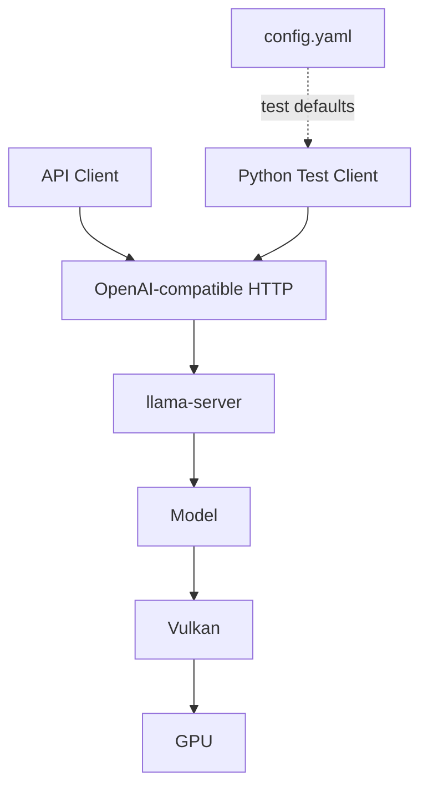

# Local Qwen Model API
Local Qwen OpenAI-Compatible Model Service

## 簡介

本專案使用 `llama.cpp` 在本機載入相容的 GGUF 模型，並提供 OpenAI-compatible Chat API。

專案範圍包含模型載入、本機推論、HTTP API、啟動腳本與基本服務驗證。

### 版本簡述

Version 1.0.0

```text
- Windows 本機 OpenAI-compatible Model API
- llama.cpp-compatible GGUF model
- OpenAI-compatible chat completions
- CPU / GPU inference backend
- Non-streaming / streaming
- Python smoke test / terminal chat test
```

## 目錄

- [簡介](#簡介)
- [專案特色](#專案特色)
- [完整架構](#完整架構)
- [檔案結構](#檔案結構)
- [測試環境](#測試環境)
- [快速開始](#快速開始)
  - [1. 取得專案與 Python 環境](#1-取得專案與-python-環境)
  - [2. 安裝 llama.cpp Vulkan Runtime](#2-安裝-llamacpp-vulkan-runtime)
  - [3. 下載模型](#3-下載模型)
  - [4. 啟動 API Server](#4-啟動-api-server)
  - [5. 驗證服務](#5-驗證服務)
- [詳細使用說明](#詳細使用說明)
- [Local API Server](#local-api-server)
- [技術整合說明](#技術整合說明)
- [常見問題](#常見問題)
- [安全與功能範圍](#安全與功能範圍)
- [特別感謝](#特別感謝)
- [關於作者](#關於作者)

## 完整架構



## 檔案結構

```text
.
├─ README.md
├─ client.py               # HTTPX 模型 Client
├─ main.py                 # 終端多輪問答測試
├─ config.yaml             # 內建 Client 預設設定
├─ requirements.txt
└─ scripts/
    ├─ start.bat           # 啟動 llama-server
    └─ test.py             # API test
```

`models/`, `runtime/llama.cpp/` 由 `.gitignore` 排除

User 需要自行下載 Runtime 與模型

## 測試環境

| 項目 | 設定 |
| --- | --- |
| OS | Windows x86_64 |
| GPU | AMD Radeon RX 6700 XT 12 GB |
| Backend | Vulkan |
| 推論引擎 | llama.cpp |
| Model | Qwen3-VL-8B-Instruct-abliterated-v2.0 |
| Quantization | Q4_K_M |
| Context / slots | 16384 / 1 |
| Python | 3.11 |

## 快速開始

### 1. 建立環境

```powershell
git clone https://github.com/hsiuyulin09/Local-LLM-Model.git
cd Local-LLM-Model

conda create -n local-model python=3.11 -y
conda activate local-model
python -m pip install -r requirements.txt
```

### 2. 安裝 llama.cpp Vulkan Runtime

本專案使用 Vulkan 測試環境。從 [llama.cpp Releases](https://github.com/ggml-org/llama.cpp/releases) 下載 Windows x64 Vulkan build，其他硬體請選擇對應 backend 的 build。

建立 Runtime 目錄：

```powershell
New-Item -ItemType Directory -Path .\runtime\llama.cpp -Force
```

將下載內容解壓縮至：

```text
runtime/llama.cpp/
```

檔案至少包含 `llama-server.exe` 與 `ggml-vulkan.dll`

```powershell
.\runtime\llama.cpp\llama-server.exe --version
```

本專案驗證的版本與 Runtime ZIP SHA-256

```text
version: 0.1.1-dev (build 10472, commit 60eeeb608)
SHA256: 2104E62C7E5237F2190240CDC987D8C3946A77051F696771D03B8D762A9D2FAE
```

### 3. 下載模型

預設測試模型來源：[Qwen3-VL-8B-Instruct-abliterated-v2.0-GGUF](https://huggingface.co/mradermacher/Qwen3-VL-8B-Instruct-abliterated-v2.0-GGUF)

```powershell
New-Item -ItemType Directory -Path ".\models\qwen3-vl-8b" -Force

$modelFile = ".\models\qwen3-vl-8b\Qwen3-VL-8B-Instruct-abliterated-v2.0.Q4_K_M.gguf"
$modelUrl = "https://huggingface.co/mradermacher/Qwen3-VL-8B-Instruct-abliterated-v2.0-GGUF/resolve/main/Qwen3-VL-8B-Instruct-abliterated-v2.0.Q4_K_M.gguf?download=true"

curl.exe --location --fail --retry 3 --continue-at - --progress-bar --output $modelFile $modelUrl
```

驗證模型

```powershell
Get-Item -LiteralPath $modelFile | Select-Object Length
Get-FileHash -LiteralPath $modelFile -Algorithm SHA256
```

SHA-256

```text
Size:   5027785824 bytes
SHA256: E462AF5C4D867483DBC58A9354D1CEE4A701EC02B49A557F4129724B23416B3D
```

### 4. 啟動 API Server

```powershell
.\scripts\start.bat
```

出現以下訊息代表服務已就緒：

```text
model loaded
listening on http://127.0.0.1:8080
```

使用 LLM 服務時 Server 終端必須保持運行。使用 `Ctrl+C` 停止服務。

### 5. 驗證服務

另開一個終端：

```powershell
conda activate local-model
python .\scripts\test.py
```

預期結果：

```text
[OK] provider: qwen3-vl-8b
[OK] POST v1/chat/completions
assistant: API test successful
```

## 詳細使用說明

使用 `scripts/start.bat` 啟動 API

`scripts/test.py` 提供 API 驗證服務

透過 `main.py` 進行終端問答測試，測試設定位於 `config.yaml`

## Local API Server

| 項目 | 設定 |
| --- | --- |
| Base URL | `http://127.0.0.1:8080/v1/` |
| 預設 model ID | `qwen3-vl-8b` |
| 建議 timeout | 600 秒 |

| Method | Endpoint | 用途 |
| --- | --- | --- |
| `GET` | `/v1/models` | 確認服務與目前 model ID |
| `POST` | `/v1/chat/completions` | 送出文字 Chat Completion |
| `GET` | `/props` | 查看 context、slot 等 Runtime 設定 |

Chat request 至少需要 `model` 與 `messages`；message 使用 `system`、`user`、`assistant` role。常用選填欄位包括 `temperature`、`max_tokens`、`top_p`、`presence_penalty` 與 `stream`。

Non-streaming 回答位於 `choices[0].message.content`。設定 `stream: true` 時，response 會以 `choices[0].delta.content` 分段回傳。

`llama-server` 不保存對話狀態，每次 request 都必須包含該次推論需要的 `messages`。目前 Server 沒有 authentication；部分 OpenAI-compatible SDK 如要求非空 API key，可使用 `local` 作為 placeholder，但它不是安全憑證。

## 技術整合說明

### llama-server

`llama-server` 負責載入 GGUF、管理 KV cache、執行 token generation，並提供 OpenAI-compatible HTTP API。Python 只用於本專案的測試程式，不是啟動 Model Server 的必要條件。

### start.bat 啟動參數

`scripts/start.bat` 使用以下參數啟動 Model Server：

| 指令或參數 | 作用 |
| --- | --- |
| `"%SERVER%"` | 執行 `llama-server.exe` |
| `-m "%MODEL%"` | 指定實際 GGUF 模型路徑 |
| `--alias qwen3-vl-8b` | 設定 API 公開的 model ID |
| `--host 127.0.0.1` | 僅監聽本機連線 |
| `--port 8080` | 設定 HTTP port |
| `-c 16384` | 設定 prompt 與輸出共用的 context 上限 |
| `-np 1` | 設定單一 active inference slot |
| `-ngl 99` | 將可用模型層 offload 至 GPU |
| `--jinja` | 啟用 Jinja chat template |
| `^` | Windows Batch 的換行接續符號，不是 llama-server 參數 |

BAT 參數設定 Server Runtime，`config.yaml` 設定內建測試 Client。`base_url` 與 `model` 必須對應 Server 的 host、port 與 alias。

### Hardware Backend

llama.cpp 不限定單一 GPU，應依作業系統、硬體與驅動程式選擇對應 build：

| Backend | 主要硬體 |
| --- | --- |
| CPU | x86 / ARM CPU |
| CUDA | NVIDIA GPU |
| HIP / ROCm | AMD GPU |
| Vulkan | 支援 Vulkan 的 GPU |
| SYCL | Intel GPU |
| Metal | Apple Silicon |

完整清單與建置方式請參考 [llama.cpp 官方文件](https://github.com/ggml-org/llama.cpp/blob/master/docs/build.md)。不同硬體需要重新評估 `-c`、`-np` 與 `-ngl`。

### Model Compatibility

模型不限定為 Qwen，如要使用預設推論引擎 llama.cpp build 需確認為有支援的 GGUF 模型。

Chat API 需要可用的 chat template，Vision 模型則需要相符的 multimodal projector。

目前 `scripts/start.bat` 與 `config.yaml` 預設使用 Qwen3-VL-8B。替換模型時需要同步修改模型路徑、`--alias`、`config.yaml` 的 `model`，以及 API request 使用的 model ID。

API 應使用 alias，不應依賴實際 GGUF filename。保留相同 alias 時，更換模型檔或量化版本不會改變 API model ID。

### Context 與 Concurrency

`-c 16384` 包含 prompt 與模型輸出，request 必須保留輸出空間，並避免送入超過上限的內容。

`-np 1` 同時間僅單一 active inference slot。複數 request 由 llama-server 排序處理，timeout 應包含等待與生成時間。

## 常見問題

| 狀況 | 處理方式 |
| --- | --- |
| 無法連線 `127.0.0.1:8080` | 執行 `scripts/start.bat`，並保持 Server 終端運行 |
| `cannot find model` | 確認 request 的 `model` 是 `qwen3-vl-8b` |
| HTTP 400 context size error | 減少歷史訊息或輸出上限，使兩者合計低於 16384 tokens |
| GPU 記憶體不足 | 降低 `-c`，必要時降低 `-ngl` |
| Request timeout | 增加 Client timeout，並考慮 `-np 1` 的排隊時間 |
| CORS 或無 API key 警告 | localhost 使用屬預期，不要在未加保護時綁定 `0.0.0.0` |

## 安全與功能範圍

目前服務沒有 authentication，且只應綁定 `127.0.0.1`。若要提供其他電腦或容器存取，應先建立 API key、Firewall、TLS 或反向代理，再調整監聽位址。

## 開源模型資源來源

- [llama.cpp](https://github.com/ggml-org/llama.cpp) 提供本機推論引擎與 OpenAI-compatible Server
- [Qwen](https://github.com/QwenLM/Qwen3-VL) 提供基礎模型架構
- [mradermacher](https://huggingface.co/mradermacher) 提供本專案使用的 GGUF 量化檔

llama.cpp 與模型檔案受各自上游授權條款約束，使用或重新散布前請查閱對應專案頁面。

## 關於作者

Hsiu-Yu Lin

GitHub: [hsiuyulin09](https://github.com/hsiuyulin09)
